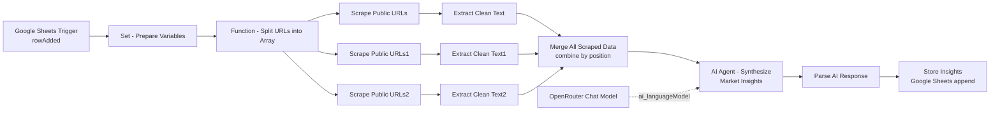

# AI Market Research & Insight Synthesizer — Workflow Documentation

| Field | Value |
|---|---|
| Workflow Name | AI Market Research & Insight Synthesizer |
| Workflow ID | `UuDYznJB0L1lAfaB` |
| Internal Revision (`versionId`) | `7c7f75dc-06f6-430c-af90-591a37db1f20` (n8n internal revision hash, not a semantic version) |
| Version | v1.0 (initial documentation) — _[semantic version to be assigned by workflow owner]_ |
| Owner | _[To be provided by workflow owner]_ |
| Active | `false` (currently deactivated in the export) |
| Last Updated | Not present in export (`updatedAt` field absent). Document generated: **09 July 2026** |

## Purpose

This workflow automates market research by watching a Google Sheet for new research requests, scraping up to three public web pages per request, cleaning the extracted text, and sending it to an AI agent (via OpenRouter) that synthesizes the raw content into structured market insights (trends, pain points, opportunities, risks, and recommended focus areas). The resulting insights are appended as a new row to a second Google Sheet tab.

## Business Use Case

_Inferred — not stated in a sticky note (there are no Sticky Note nodes in this export)._ The workflow appears designed to let a non-technical user queue up a market/niche research request (with a handful of source URLs) by simply adding a row to a spreadsheet, and receive back a structured, decision-ready insight summary without manually reading each source. Please confirm or replace this with the actual business justification.

## Workflow Summary

A new row in the **Research_Queue** Google Sheet tab (with a market niche, geography, target audience, and a comma-separated list of URLs) triggers the workflow every minute via polling. The row's fields are normalized in a **Set** node, then a **Code** node splits the URL list into three individual URL slots. Each of the three URLs is fetched in parallel by its own **HTTP Request** node and immediately cleaned (HTML stripped, entities decoded, whitespace normalized, truncated to 4,000 characters) by a paired **Code** node. The three cleaned text blocks are recombined by a **Merge** node (combine-by-position), then passed to an **AI Agent** node backed by an **OpenRouter Chat Model** (`nvidia/nemotron-nano-12b-v2-vl:free`), which is instructed to return a strict JSON object of market insights. A final **Code** node parses/repairs that JSON and flattens its arrays into pipe-delimited strings, which are then appended as a new row to the **Research_Results** sheet tab via a **Google Sheets** node.

## Workflow Diagram

See the attached canvas screenshot (`AI_Market_Research___Insight_Synthesizer.png`). Shape: **linear trigger → fan-out (3 parallel scrape/clean branches) → fan-in (Merge) → AI Agent → linear tail (parse → store)**.



**Cross-check note:** the screenshot shows optional **Memory** and **Tool** input ports on the AI Agent node with small "+" icons. These are unconnected UI affordances, not active connections — confirmed against the JSON `connections` block, which shows only an `ai_languageModel` link from **OpenRouter Chat Model** into the agent. No memory or tool sub-nodes are wired in.

## Trigger Details

**Single trigger:** `Google Sheets Trigger`

| Property | Value |
|---|---|
| Event | `rowAdded` |
| Poll interval | Every minute (`pollTimes.item.mode = "everyMinute"`) |
| Spreadsheet | `AI Market Research & Insight Synthesizer` (ID `1Pm0ndqy8paG8TQRS50wcvSCeD8ZUTzyT1dB0NLbQehQ`) |
| Sheet/Tab | `Research_Queue` (`gid=0`) |
| Credential | Google Sheets Trigger account (OAuth2) |

The workflow starts whenever a new row is appended to the `Research_Queue` tab. Because this is a polling trigger (not a push webhook), there is up to a ~1 minute delay between the row being added and the workflow firing.

## Execution Flow

1. **Google Sheets Trigger** fires on a new row in `Research_Queue`, emitting the row's columns (`market_niche`, `geography`, `target_audience`, `urls_to_scrape`).
2. **Set - Prepare Variables** maps those columns into clean workflow variables: `niche`, `geo`, `audience`, `urls_list`, `timestamp`.
3. **Function - Split URLs into Array** (Code node) attempts to `JSON.parse` `urls_list` and distributes up to three URLs into `url_1`, `url_2`, `url_3`, carrying `niche`/`geo`/`audience`/`timestamp` forward.
4. The single output item fans out to **three parallel branches**, each reading a different URL field from the same item:
   - `url_1` → **Scrape Public URLs** (HTTP GET) → **Extract Clean Text** → outputs `text_content1`
   - `url_2` → **Scrape Public URLs1** (HTTP GET) → **Extract Clean Text1** → outputs `text_content2`
   - `url_3` → **Scrape Public URLs2** (HTTP GET) → **Extract Clean Text2** → outputs `text_content3`
5. **Merge All Scraped Data** combines the three branch outputs **by position** (input 1/2/3 → one merged item) into a single item carrying `text_content1`, `text_content2`, `text_content3` (each branch's own fields survive the merge on the same row since combine-by-position keeps each input's fields).
6. **AI Agent - Synthesize Market Insights** builds a prompt from `niche`/`geo`/`audience` (re-pulled from the **Set - Prepare Variables** node by name) plus the three text blocks, sends it to the **OpenRouter Chat Model** (`nvidia/nemotron-nano-12b-v2-vl:free`), and returns a JSON-formatted insight object as `output`.
7. **Parse AI Response** (Code node) strips any Markdown code-fence wrapping, `JSON.parse`s the agent's `output`, flattens each insight array into a `" | "`-joined string, and reattaches `research_id`/`niche`/`geo`/`audience`/`timestamp`.
8. **Store Insights** appends one row to the `Research_Results` tab with the flattened insight fields.

There is no conditional branching (no IF/Switch nodes) and no loop-back — every run processes exactly one queue row through the same fixed 3-URL path.

## Node List

| # | Node Name | Type | Purpose | Disabled |
|---|---|---|---|---|
| 1 | Google Sheets Trigger | `n8n-nodes-base.googleSheetsTrigger` | Polls `Research_Queue` tab for new rows | No |
| 2 | Set - Prepare Variables | `n8n-nodes-base.set` | Normalizes trigger row into `niche`/`geo`/`audience`/`urls_list`/`timestamp` | No |
| 3 | Function - Split URLs into Array | `n8n-nodes-base.code` | Parses `urls_list` into `url_1`/`url_2`/`url_3` | No |
| 4 | Scrape Public URLs | `n8n-nodes-base.httpRequest` | GET request for `url_1` | No |
| 5 | Scrape Public URLs1 | `n8n-nodes-base.httpRequest` | GET request for `url_2` | No |
| 6 | Scrape Public URLs2 | `n8n-nodes-base.httpRequest` | GET request for `url_3` | No |
| 7 | Extract Clean Text | `n8n-nodes-base.code` | Cleans HTML from branch 1 → `text_content1` | No |
| 8 | Extract Clean Text1 | `n8n-nodes-base.code` | Cleans HTML from branch 2 → `text_content2` | No |
| 9 | Extract Clean Text2 | `n8n-nodes-base.code` | Cleans HTML from branch 3 → `text_content3` | No |
| 10 | Merge All Scraped Data | `n8n-nodes-base.merge` | Combines the 3 branches by position into one item | No |
| 11 | OpenRouter Chat Model | `@n8n/n8n-nodes-langchain.lmChatOpenRouter` | LLM sub-node supplying the AI Agent (`ai_languageModel` link) | No |
| 12 | AI Agent - Synthesize Market Insights | `@n8n/n8n-nodes-langchain.agent` | Synthesizes cleaned text into structured JSON insights | No |
| 13 | Parse AI Response | `n8n-nodes-base.code` | Parses/repairs AI JSON output, flattens arrays | No |
| 14 | Store Insights | `n8n-nodes-base.googleSheets` | Appends the final insight row to `Research_Results` | No |

## Node-by-Node Description

### Google Sheets Trigger
Polls the `Research_Queue` tab every minute for newly added rows. Emits the raw row as JSON, with column headers as keys (`market_niche`, `geography`, `target_audience`, `urls_to_scrape`).

### Set - Prepare Variables
An **Edit Fields (Set)** node (v3.4) that creates five string fields from the incoming row:
- `niche` = `{{ $json.market_niche }}`
- `geo` = `{{ $json.geography }}`
- `audience` = `{{ $json.target_audience }}`
- `urls_list` = `{{ $json.urls_to_scrape.split(',').map(u => u.trim()) }}`
- `timestamp` = `{{ $now.format('dd-MM-yyyy') }}`

All five are typed as `string` in the Set node's assignment config, meaning the array produced by `.split(',').map(...)` for `urls_list` is coerced to its string representation rather than staying a native array. See **Known Limitations**.

### Function - Split URLs into Array
A Code node that tries `JSON.parse($input.item.json.urls_list)` inside a `try/catch`, falling back to an empty array on failure. It then assigns `urls[0]`, `urls[1]`, `urls[2]` to `url_1`, `url_2`, `url_3` respectively (empty string if missing), and passes `niche`, `geo`, `audience`, `timestamp` through unchanged.

### Scrape Public URLs / Scrape Public URLs1 / Scrape Public URLs2
Three near-identical **HTTP Request** nodes (GET), each reading a different URL field (`url_1`, `url_2`, `url_3`) from the same incoming item. Common configuration across all three:
- Method: GET (default)
- `allowUnauthorizedCerts`: `true`
- Response format: `text`
- Timeout: `10000` ms

### Extract Clean Text / Extract Clean Text1 / Extract Clean Text2
Three near-identical Code nodes, one per scrape branch. Each:
1. Reads `$input.item.json.data` (the HTTP Request's raw text response) and `$input.item.json.clean_url` (see **Known Limitations** — this field is never set upstream).
2. Strips `<script>`/`<style>` blocks and all remaining HTML tags via regex.
3. Decodes `&nbsp;`, `&amp;`, `&lt;`, `&gt;`, `&quot;` entities.
4. Collapses whitespace and trims.
5. Truncates to 4,000 characters.
6. Outputs `url`, a branch-specific field (`text_content1`, `text_content2`, or `text_content3`), and `word_count`.

### Merge All Scraped Data
A **Merge** node in `combine` mode, `combineByPosition`, with `numberInputs: 3`. Takes the single item from each of the three cleaning branches and produces one merged item carrying all three `text_contentN` fields (this works correctly only because each branch always yields exactly one item — see **Known Limitations**).

### OpenRouter Chat Model
LangChain LLM sub-node (`lmChatOpenRouter`) configured with model `nvidia/nemotron-nano-12b-v2-vl:free` and default options. Connected to the AI Agent node via the `ai_languageModel` connection type — it does not sit in the main data path.

### AI Agent - Synthesize Market Insights
LangChain **Agent** node (`promptType: define`) with:
- A **user prompt** built from `niche`/`geo`/`audience` (pulled by name from **Set - Prepare Variables**, not from the immediately preceding node) and the three `text_contentN` fields from the merged item, instructing the model to return only a JSON object with `summary`, `top_trends`, `common_pain_points`, `opportunities`, `risks`, `recommended_focus_areas`.
- A **system message** framing the model as an expert market research analyst focused on concise, decision-relevant output.
- No memory or tool sub-nodes attached (single-turn completion agent).

### Parse AI Response
Code node that takes `$input.item.json.output` (the agent's raw text/JSON), strips ```` ```json ```` / ```` ``` ```` fences if present, and `JSON.parse`s it. It then builds a flat output object combining `research_id`/`niche`/`geo`/`audience` (pulled from **Set - Prepare Variables** by name), a fresh ISO `timestamp`, and each insight array joined with `" | "` into a single string field.

### Store Insights
**Google Sheets** node, `append` operation, targeting the `Research_Results` tab (`gid=514828305`) of the same spreadsheet. Uses manual column mapping (see **Google Sheets Schema / Node Configuration** below).

## Node Configuration

### Set - Prepare Variables — field expressions
```
niche      = {{ $json.market_niche }}
geo        = {{ $json.geography }}
audience   = {{ $json.target_audience }}
urls_list  = {{ $json.urls_to_scrape.split(',').map(u => u.trim()) }}
timestamp  = {{ $now.format('dd-MM-yyyy') }}
```

### Function - Split URLs into Array — logic summary
Parses `urls_list` as JSON, defaults to `[]` on any parse error, and maps up to the first three array entries onto `url_1`/`url_2`/`url_3` (empty string if absent).

### HTTP Request nodes — shared options
```
responseFormat: text
allowUnauthorizedCerts: true
timeout: 10000 ms
url: {{ $json.url_1 }}  /  {{ $json.url_2 }}  /  {{ $json.url_3 }}
```

### Extract Clean Text (×3) — logic summary
HTML → plain text pipeline: strip `<script>`/`<style>`, strip remaining tags, decode 5 common entities, collapse whitespace, truncate to 4000 chars, compute `word_count`.

### AI Agent — prompt (user message)
```
Analyze the following market research data and extract actionable insights.

MARKET NICHE: {{ $('Set - Prepare Variables').item.json.niche }}
GEOGRAPHY: {{ $('Set - Prepare Variables').item.json.geo }}
TARGET AUDIENCE: {{ $('Set - Prepare Variables').item.json.audience }}

RESEARCH DATA : {{ $json.text_content1 }}

                {{ $json.text_content2 }}

                {{ $json.text_content3 }}

YOUR TASK:
Analyze this data and return ONLY valid JSON with the following structure (no markdown, no extra text):

{
"summary": "2-3 sentence executive summary of the market state",
"top_trends": ["trend 1", "trend 2", "trend 3"],
"common_pain_points": ["pain point 1", "pain point 2", "pain point 3"],
"opportunities": ["opportunity 1", "opportunity 2", "opportunity 3"],
"risks": ["risk 1", "risk 2"],
"recommended_focus_areas": ["focus area 1", "focus area 2"]
}

CRITICAL:
Return ONLY the JSON object.
Do NOT include explanations, markdown, or additional text.
```

### AI Agent — system message
```
You are an expert market research analyst with deep experience in trend analysis, customer behavior, and competitive intelligence.
Your job is to analyze unstructured market data and extract clear, actionable, business-focused insights.
You must think critically, avoid fluff, and prioritize insights that help decision-makers identify trends, risks, and opportunities.
Always return structured, concise, and practical outputs.
```

### Parse AI Response — logic summary
Strips Markdown code fences from `output`, `JSON.parse`s it, and emits:
```
research_id, niche, geo, audience, timestamp (fresh ISO string),
summary, top_trends, common_pain_points, opportunities, risks,
recommended_focus_areas   // each array field joined with " | "
```

### Store Insights — column mapping (append)
```
niche                    = {{ $json.niche }}
geo                      = {{ $json.geo }}
audience                 = {{ $json.audience }}
summary                  = {{ $json.summary }}
top_trends               = {{ $json.top_trends }}
common_pain_points       = {{ $json.common_pain_points }}
risks                    = {{ $json.risks }}
opportunities            = {{ $json.opportunities }}
recommended_focus_areas  = {{ $json.recommended_focus_areas }}
timestamp                = {{ $json.timestamp }}
research_id              = {{ }}   // empty expression — see Known Limitations
```

## Variables & Expressions

Notable non-trivial expressions:

| Expression | Node | What it computes |
|---|---|---|
| `$json.urls_to_scrape.split(',').map(u => u.trim())` | Set - Prepare Variables | Splits a comma-separated URL string into a trimmed array (then coerced to string by the Set node's `string` type) |
| `$now.format('dd-MM-yyyy')` | Set - Prepare Variables | Current date, `DD-MM-YYYY` format |
| `JSON.parse($input.item.json.urls_list)` | Function - Split URLs into Array | Re-parses the (stringified) URL array — see Known Limitations |
| `$('Set - Prepare Variables').item.json.niche` (and `.geo`, `.audience`) | AI Agent prompt, Parse AI Response | Pulls values by **node name reference** rather than from the immediately upstream item, so these survive the Merge step unchanged |
| `aiResponse.top_trends.join(' | ')` (and similarly for other arrays) | Parse AI Response | Flattens each JSON array from the AI output into a single pipe-delimited string for spreadsheet storage |

## Credentials Used

| Node | Credential Name | Credential Type | Service |
|---|---|---|---|
| Google Sheets Trigger | Google Sheets Trigger account | `googleSheetsTriggerOAuth2Api` | Google Sheets |
| OpenRouter Chat Model | OpenRouter account for AI Journal | `openRouterApi` | OpenRouter |
| Store Insights | Google Sheets account | `googleSheetsOAuth2Api` | Google Sheets |

No secret values are present in the export (n8n only exports credential name + internal ID references).

## Input Data

Trigger payload is one row from `Research_Queue`, expected to contain:

| Column | Type | Notes |
|---|---|---|
| `market_niche` | string | Market/niche to research |
| `geography` | string | Target geography |
| `target_audience` | string | Target audience description |
| `urls_to_scrape` | string | Comma-separated list of up to 3 public URLs |

## Output Data

One row appended to `Research_Results` with columns: `niche`, `geo`, `audience`, `summary`, `top_trends`, `common_pain_points`, `risks`, `opportunities`, `recommended_focus_areas`, `timestamp`, `research_id` (see Known Limitations regarding `research_id`).

## Data Transformation

- **Set - Prepare Variables**: field renaming/normalization from raw sheet columns to internal variable names; also converts a comma-separated string into an array-like value.
- **Function - Split URLs into Array**: array → three discrete scalar fields (`url_1/2/3`).
- **Extract Clean Text (×3)**: HTML → plain text (tag stripping, entity decoding, whitespace normalization, truncation).
- **Merge All Scraped Data**: three single-field items → one item with three fields (positional join).
- **Parse AI Response**: nested JSON arrays → flat pipe-delimited strings, suitable for spreadsheet columns.

## API Integrations / External Services

| Service | Node(s) | Method/Auth | Purpose |
|---|---|---|---|
| Arbitrary public web pages (as supplied in the sheet) | Scrape Public URLs / URLs1 / URLs2 | HTTP GET, no auth, `allowUnauthorizedCerts: true` | Fetch raw HTML for research |
| OpenRouter | OpenRouter Chat Model | OpenRouter API key (`openRouterApi` credential) | LLM completion for insight synthesis, model `nvidia/nemotron-nano-12b-v2-vl:free` |
| Google Sheets API | Google Sheets Trigger, Store Insights | OAuth2 | Poll queue / append results |

## AI/LLM Integration

- **Provider**: OpenRouter
- **Model**: `nvidia/nemotron-nano-12b-v2-vl:free`
- **Node type**: `@n8n/n8n-nodes-langchain.agent` (single LLM sub-node, no tools, no memory)
- **System prompt**: positions the model as an expert market research analyst (see Node Configuration above)
- **User prompt**: injects niche/geo/audience plus three cleaned text blocks, and demands a strict JSON-only response with six named fields
- **Downstream consumption**: the agent's `output` field is read by **Parse AI Response**, which strips Markdown fencing and `JSON.parse`s it before flattening into spreadsheet columns. There is no schema/type validation of the parsed object beyond what `JSON.parse` naturally provides — if the model returns a differently-shaped object (e.g., missing a key), the `.join(' | ')` calls in **Parse AI Response** will throw.

## Error Handling

No node in this workflow has `continueOnFail`/`onError` configured, and `settings` does not define an `errorWorkflow`. This means **any single node failure aborts the entire run** for that queue row — e.g., a dead link causing a non-200 HTTP response, a scrape timeout, or a JSON-parse failure on the AI output will stop the workflow with no fallback path and no notification.

## Retry Strategy

No `retryOnFail`/`maxTries`/`waitBetweenTries` settings are configured on any node, including the three HTTP Request nodes that call third-party public URLs. A transient network failure on any one of the three scrape requests will fail that row's execution outright with no automatic retry.

## Logging

No dedicated logging node (e.g., a Sheets/DB write on the error path) exists. The only execution record is n8n's own built-in execution log/history for this workflow.

## Execution Order

`settings.executionOrder: "v1"` — connection-based execution order (the modern default), meaning the three scrape/clean branches execute according to graph dependencies rather than a legacy top-to-bottom order.

## Dependencies

- **Google Sheets** (`AI Market Research & Insight Synthesizer` spreadsheet, both `Research_Queue` and `Research_Results` tabs) must exist with the expected column headers and be reachable via the configured OAuth2 credentials.
- **OpenRouter API** must be reachable and the `nvidia/nemotron-nano-12b-v2-vl:free` model must remain available under the free tier for the configured account.
- **Target websites** referenced in `urls_to_scrape` must be publicly reachable, respond within 10 seconds, and not require authentication.

## Security Considerations

- All three HTTP Request nodes set `allowUnauthorizedCerts: true`, disabling TLS certificate validation for outbound scrape requests — this weakens protection against man-in-the-middle responses.
- Target URLs are taken directly from spreadsheet input with no domain allowlist/denylist, so anyone able to add rows to `Research_Queue` can cause the workflow to issue outbound GET requests to arbitrary hosts (including internal/private network addresses, if reachable from the n8n host) — a potential SSRF-style exposure depending on deployment environment.
- No webhook is used, so no webhook auth type applies.
- Google Sheets and OpenRouter credentials are OAuth2/API-key based and stored via n8n's credential system (not present in this export). _Formal sign-off: [To be provided by workflow owner / security reviewer]._

## Performance Considerations

- Each run performs up to 3 parallel HTTP GET requests (10s timeout each) plus one LLM completion call; overall latency is dominated by the slowest of the three scrapes plus the AI Agent call.
- Scraped text is capped at 4,000 characters per source (≈12,000 characters total feeding the prompt), which bounds LLM token usage but also means longer source pages are silently truncated.
- Trigger polling runs every minute regardless of whether new rows exist, adding constant background API calls to Google Sheets.

## Execution Time

_[To be provided by workflow owner — requires execution data]_

## Resource Usage

_[To be provided by workflow owner — requires execution data]_

## Testing & Validation

_[To be provided by workflow owner]_

## Troubleshooting

- **`Research_Results` row has a blank `research_id`**: expected given current configuration — the **Store Insights** mapping for `research_id` is a bare `=` expression (no value), and **Set - Prepare Variables** never defines a `research_id` field in the first place. See Known Limitations.
- **No scraped content reaches the AI Agent / insights look empty or generic**: check whether `urls_list` is being correctly re-parsed in **Function - Split URLs into Array** — the `JSON.parse` there expects JSON-array syntax, but the upstream Set node likely stores it as a plain comma-joined string (see Known Limitations). If parsing fails, `url_1/2/3` will all be empty strings and every scrape request will target an empty URL.
- **A run stops partway with no output row**: since no node has `continueOnFail` set, check the execution log for the first failing node — most likely one of the three HTTP Request nodes (dead link, timeout, non-200) or **Parse AI Response** (`JSON.parse` failure if the model didn't return clean JSON).
- **`Extract Clean Text*` nodes output an empty `url` field**: expected — these nodes read `$input.item.json.clean_url`, a field that is never set anywhere upstream in this export.

## Known Limitations

1. **`research_id` is never generated.** `Parse AI Response` reads `$('Set - Prepare Variables').item.json.research_id`, but `Set - Prepare Variables` only defines `niche`, `geo`, `audience`, `urls_list`, `timestamp` — no `research_id`. This will resolve to `undefined`.
2. **`Store Insights` maps `research_id` to an empty expression** (`"research_id": "="`), independently guaranteeing a blank/invalid value in that column regardless of item #1.
3. **Likely broken URL parsing.** `urls_list` is produced in `Set - Prepare Variables` via `.split(',').map(u => u.trim())` but declared as type `string`, so n8n stores its string representation (comma-joined, unquoted) rather than a JSON array. `Function - Split URLs into Array` then calls `JSON.parse()` on that string, which is not valid JSON syntax and will throw — caught by the `try/catch`, silently defaulting to `[]`, meaning `url_1/2/3` end up empty and the scrape nodes request empty URLs. **This is a high-priority bug to verify/fix before production use.**
4. **`clean_url` is referenced but never set.** All three `Extract Clean Text*` nodes read `$input.item.json.clean_url`, which no upstream node defines (the HTTP Request node's `text` response format only returns the body under `data`). The `url` field in cleaned output will always be an empty string.
5. **Hardcoded to exactly 3 sources.** The fan-out is fixed at three branches (`url_1/2/3`); the workflow cannot scale up or down without manually adding/removing HTTP Request + Code node pairs and adjusting `Merge`'s `numberInputs`.
6. **No error handling or retry anywhere.** Any single failed HTTP request, timeout, or malformed AI JSON response aborts the entire row with no retry and no failure notification.
7. **TLS validation disabled** (`allowUnauthorizedCerts: true`) on all outbound scrape requests.
8. **AI Agent has no memory or tools connected** — despite the canvas showing optional Memory/Tool ports, it operates as a single-turn completion agent only.
9. **Merge-by-position fragility.** `Merge All Scraped Data` assumes each of the three branches always yields exactly one item; if any branch yields zero items (e.g., empty URL per limitation #3, or a failed request that still emits no output), positional alignment across the merged fields can break silently.

## Assumptions

- Assumed the `Research_Queue` sheet's column headers are exactly `market_niche`, `geography`, `target_audience`, and `urls_to_scrape`, based on the expressions in **Set - Prepare Variables**.
- Assumed `urls_to_scrape` is intended to hold up to three comma-separated URLs, since the workflow only has three parallel scrape branches.
- Assumed the `Research_Results` sheet tab already has header columns matching the keys used in **Store Insights**' manual column mapping (`niche`, `geo`, `audience`, `summary`, `top_trends`, `common_pain_points`, `risks`, `opportunities`, `recommended_focus_areas`, `timestamp`, `research_id`).
- Assumed the workflow is intended to run in the n8n instance's default timezone, since `settings` sets no timezone override.
- Assumed the Memory/Tool ports visible on the AI Agent node in the screenshot are inactive UI affordances rather than hidden connections, based on cross-checking against the `connections` block in the JSON (only `ai_languageModel` is wired).

## Version History / Change Log

_[To be provided by workflow owner]_

## References

_[To be provided by workflow owner]_

## Maintenance Notes

_[To be provided by workflow owner]_
